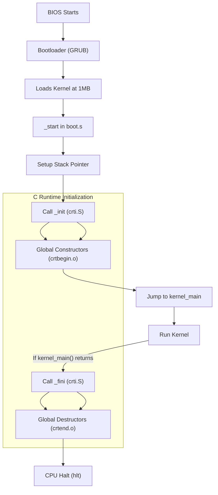

```mermaid
flowchart TD
    %% Global External Dependencies
    External["External Dependencies<br/>(i686-elf toolchain, GRUB, QEMU, GNU Make)"]:::external

    %% Boot Loader Node
    BootLoader["Boot Loader<br/>(GRUB/QEMU)"]:::external

    %% Kernel Subgraph
    subgraph "Kernel"
        direction TB
        %% Boot Code Subgraph
        subgraph "Boot Code (i386)"
            direction TB
            BootFile["boot.S"]:::kernel
            Crti["crti.S"]:::kernel
            Crtn["crtn.S"]:::kernel
            Linker["linker.ld"]:::kernel
            TTY["tty.c"]:::kernel
            VGA["vga.h"]:::kernel
        end
        %% Kernel Core Subgraph
        subgraph "Kernel Core"
            direction TB
            KernelCore["kernel.c"]:::kernel
        end
    end

    %% Libc Subgraph
    subgraph "C Standard Library (libc)"
        direction TB
        LibcMakefile["Makefile"]:::libc
        StdIO["stdio.h"]:::libc
        StdLib["stdlib.h"]:::libc
        String["string.h"]:::libc
    end

    %% Build Scripts Subgraph
    subgraph "Build & Utility Scripts"
        direction TB
        build_sh["build.sh"]:::script
        run_sh["run.sh"]:::script
        clean_sh["clean.sh"]:::script
        config_sh["config.sh"]:::script
        headers_sh["headers.sh"]:::script
        iso_sh["iso.sh"]:::script
        target_sh["target-triplet-to-arch.sh"]:::script
    end

    %% Documentation Subgraph
    subgraph "Documentation & Resources"
        direction TB
        ControlFlow["control_flow.md"]:::doc
        Flowchart["flowchart.md"]:::doc
        Resources["resources.md"]:::doc
    end

    %% Future Enhancements Node
    Future["Future Enhancements<br/>(Memory management, Drivers, Process management, etc.)"]:::future

    %% Relationships
    External -->|"provides"| BootLoader
    BootLoader -->|"loads"| BootFile
    BootFile -->|"triggers init"| KernelCore
    KernelCore -->|"calls"| LibcMakefile
    %% Build Automation linking
    build_sh ---|"builds"| KernelCore
    build_sh ---|"builds"| LibcMakefile
    %% Future enhancements planning from Kernel
    KernelCore ---|"planned"| Future

    %% Class Definitions for styling
    classDef external fill:#AED6F1,stroke:#1B4F72,stroke-width:2px;
    classDef kernel fill:#A9DFBF,stroke:#196F3D,stroke-width:2px;
    classDef libc fill:#F9E79F,stroke:#B7950B,stroke-width:2px;
    classDef script fill:#F5CBA7,stroke:#873600,stroke-width:2px;
    classDef doc fill:#D2B4DE,stroke:#6C3483,stroke-width:2px;
    classDef future fill:#F1948A,stroke:#922B21,stroke-width:2px;

    %% Click Events for Kernel Components
    click BootFile "https://github.com/stre4k/aprismaos/blob/main/kernel/arch/i386/boot.S"
    click Crti "https://github.com/stre4k/aprismaos/blob/main/kernel/arch/i386/crti.S"
    click Crtn "https://github.com/stre4k/aprismaos/blob/main/kernel/arch/i386/crtn.S"
    click Linker "https://github.com/stre4k/aprismaos/blob/main/kernel/arch/i386/linker.ld"
    click TTY "https://github.com/stre4k/aprismaos/blob/main/kernel/arch/i386/tty.c"
    click VGA "https://github.com/stre4k/aprismaos/blob/main/kernel/arch/i386/vga.h"
    click KernelCore "https://github.com/stre4k/aprismaos/blob/main/kernel/kernel/kernel.c"

    %% Click Events for libc Components
    click LibcMakefile "https://github.com/stre4k/aprismaos/tree/main/libc/Makefile"
    click StdIO "https://github.com/stre4k/aprismaos/blob/main/libc/include/stdio.h"
    click StdLib "https://github.com/stre4k/aprismaos/blob/main/libc/include/stdlib.h"
    click String "https://github.com/stre4k/aprismaos/blob/main/libc/include/string.h"

    %% Click Events for Build Scripts
    click build_sh "https://github.com/stre4k/aprismaos/blob/main/build.sh"
    click run_sh "https://github.com/stre4k/aprismaos/blob/main/run.sh"
    click clean_sh "https://github.com/stre4k/aprismaos/blob/main/clean.sh"
    click config_sh "https://github.com/stre4k/aprismaos/blob/main/config.sh"
    click headers_sh "https://github.com/stre4k/aprismaos/blob/main/headers.sh"
    click iso_sh "https://github.com/stre4k/aprismaos/blob/main/iso.sh"
    click target_sh "https://github.com/stre4k/aprismaos/blob/main/target-triplet-to-arch.sh"

    %% Click Events for Documentation
    click ControlFlow "https://github.com/stre4k/aprismaos/blob/main/docs/control_flow.md"
    click Flowchart "https://github.com/stre4k/aprismaos/blob/main/docs/flowchart.md"
    click Resources "https://github.com/stre4k/aprismaos/blob/main/docs/resources.md"
```

### **Explanation of Flowchart**
1. **BIOS Starts** → Loads GRUB.
2. **GRUB** → Loads the kernel into memory at `1MB`.
3. **`_start` in `boot.s`** runs.
4. **Stack Pointer is initialized**.
5. **`_init` (from `crti.S`) runs**, preparing for global constructors.
6. **`crtbegin.o` inserts global constructor logic**.
7. **Kernel execution starts (`kernel_main()`)**.
8. **If `kernel_main()` returns**, `_fini` runs for global destructors.
9. **`crtend.o` inserts destructor cleanup**.
10. **CPU halts (`hlt`)** to prevent unintended execution.

This flowchart **shows how the bootloader, kernel, and C runtime initialization interact**.

